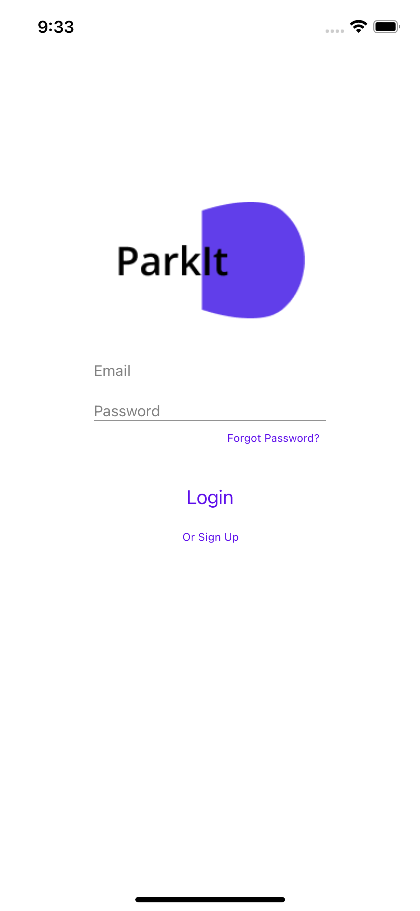

# ParkIt 
     SC2006 Software Engineering Lab Project

# 🛠️ Tech Stack & APIs Used
We built ParkIt with a powerful set of technologies:

Frontend: React Native (cross platform)

Backend: Firebase

Database: Firestore

APIs: 
- OpenStreetMap Nominatim API to get the coordinates of the entered location.
- URA Car Park Details API to get the list of URA car parks as well as their details.

# 🌟Screenshots of app on IOS Simulator

### Login, Sign up and Forget Password screens

<p align="middle">
  
  
  
</p>

### Searching for carparks at destination

<p align="middle">
  
  
</p>

### Search History and Settings

<p align="middle">
  
  
</p>

# Project Folder Structure

```terminal
.
├── assets              # images
├── firebase            # backend
├── Lab Deliverables    # Lab 5 deliverables for submission
├── screens             # user interface
└── README.md
```

# Develop

> To further develop this project, clone this repo and make sure you have the following prerequisites.

- [Node](https://nodejs.org/en/download/)
- [Expo Go](https://expo.dev/client) on your preferred device

> From your command line go to the folder directory and run the following scripts in the terminal.

1\. Clone the repo

```terminal
git clone https://github.com/bohyanggg/ParkIt.git
```

2\. Go to project directory

```terminal
cd ParkIt
```

3\. Install dependencies

```terminal
npm install
```

4\. Start the expo

```terminal
npx expo start
```

# App Demo

- [Demo](https://youtu.be/5hKf5ObB2pQ)


## Contributors - Team Softies

- [@bohyanggg](https://github.com/bohyanggg)
- [@limx0139](https://github.com/limx0139)
- [@DivineValleys](https://github.com/DivineValleys)
- [@YQ0195](https://github.com/YQ0195)

